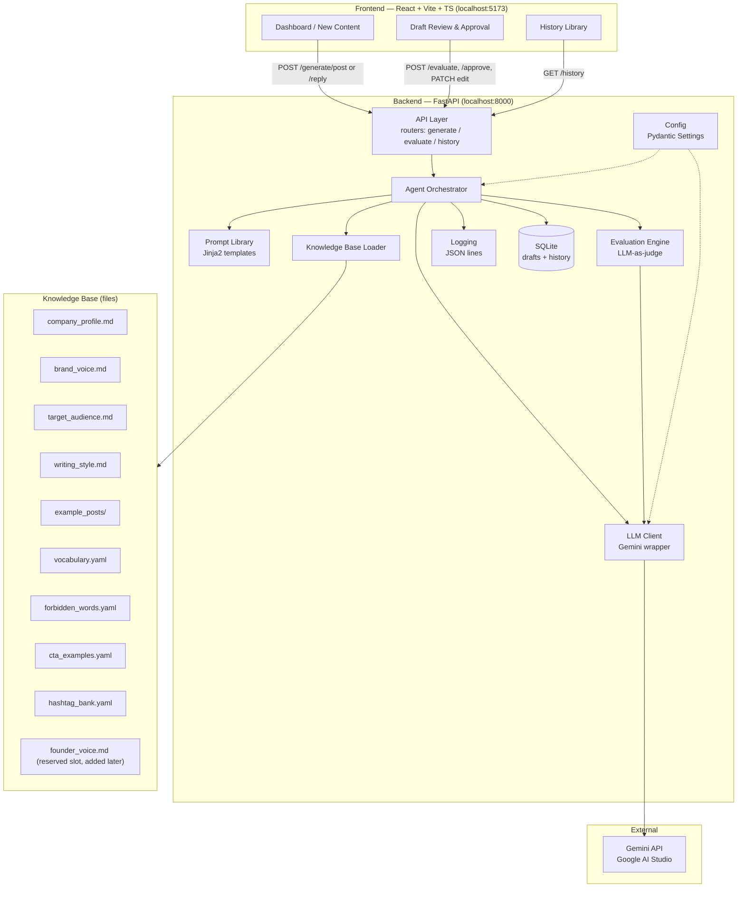

# ARCHITECTURE.md — ENTROGX LinkedIn Surge Agent (Mission A)

## 1. System Overview

The system is a local, single-user application with a Python/FastAPI backend and a React/TypeScript frontend. The backend owns all LLM interaction, brand knowledge, evaluation logic, and persistence. The frontend is a thin review/approval client — it holds no business logic. Nothing in V1 talks to LinkedIn or any external system besides Google AI Studio (Gemini API).

## 2. Component Diagram



## 3. Layer Responsibilities

| Layer | Responsibility | Tech | Maps to Rubric |
|---|---|---|---|
| Frontend | Input capture, draft review/edit, approve/reject, history browsing | React + Vite + TypeScript, `fetch`-based API client, no state library | Human checkpoint for all 4 criteria |
| Backend / API | HTTP boundary, request validation | FastAPI + Pydantic schemas | — |
| LLM layer | All calls to Gemini: retries, model/temperature config, token accounting | Google Gen AI Python SDK (`google-genai`), single wrapper class | All 4 (it's the generation engine) |
| Prompt layer | Versioned templates, KB-context injection, prompt text kept out of Python code | Jinja2 `.md` template files under `backend/app/prompts/` | Strategy, Messaging Precision |
| Knowledge Base | Source-of-truth brand facts, injected as context — **not** a vector DB in V1 | Markdown + YAML files, loaded at request time | Strategy & Planning, Messaging Precision |
| Memory | Per-request conversation state only; persisted generation history doubles as institutional memory for future prompt tuning | SQLite table `generations` | — |
| API layer | `/generate/post`, `/generate/reply`, `/evaluate`, `/history`, `/health` | FastAPI routers | — |
| Evaluation layer | Scores each draft 0–10 on the 4 rubric categories, returns rationale, triggers auto-revise loop (capped) | Second Gemini call using `content_evaluator` + `content_improver` prompts | All 4 (this is the self-check mechanism) |
| Logging | Every generation/evaluation call logged with prompt version, tokens, latency, scores | Python `logging` → JSON lines file `logs/agent.log` | — |
| Configuration | API keys, model name, temperature, eval thresholds, iteration caps | `.env` + `pydantic-settings` | — |
| Deployment | Local dev only: `uvicorn` + `vite dev` | No Docker/cloud in V1 | — |

## 4. Folder Structure

```
linkedin-surge-agent/
├── backend/
│   ├── app/
│   │   ├── main.py                  # FastAPI app entrypoint
│   │   ├── api/                     # routers: generate.py, evaluate.py, history.py
│   │   ├── core/                    # config.py (Settings), logging.py
│   │   ├── services/                # orchestrator.py, llm_client.py, kb_loader.py, evaluator.py
│   │   ├── prompts/                 # system_prompt.md, post_generator.md, ... (Prompt Library)
│   │   ├── knowledge/               # company_profile.md, brand_voice.md, example_posts/, *.yaml (Knowledge Base)
│   │   ├── models/                  # Pydantic request/response schemas
│   │   └── db/                      # SQLite models + session
│   ├── tests/                       # pytest: kb_loader, orchestrator, evaluator sanity checks
│   ├── requirements.txt
│   └── .env.example
├── frontend/
│   ├── src/
│   │   ├── pages/                   # NewContent.tsx, ReviewDraft.tsx, History.tsx
│   │   ├── components/              # DraftCard, ScoreBadge, VisualBriefPanel, etc.
│   │   ├── api/                     # client.ts (typed fetch wrapper to backend)
│   │   └── types/                   # shared TS types mirroring backend Pydantic schemas
│   ├── public/
│   └── package.json
├── scripts/                          # dev.sh / dev.ps1 to boot both servers, seed_kb.py
├── examples/                         # sample generated posts kept for demo/grading evidence
├── PROJECT_PLAN.md
├── ARCHITECTURE.md
├── TASK_TRACKER.md
├── SYSTEM_WORKFLOW.md
├── TECH_STACK.md
├── .gitignore
└── README.md
```

Responsibility of each top-level folder:

| Folder | Responsibility |
|---|---|
| `backend/app/api/` | Thin HTTP layer — request/response only, delegates to `services/` |
| `backend/app/core/` | Cross-cutting concerns: settings, logging setup |
| `backend/app/services/` | All business logic: orchestration, LLM calls, KB loading, evaluation |
| `backend/app/prompts/` | The Prompt Library — every prompt sent to Gemini, as versioned files |
| `backend/app/knowledge/` | The Knowledge Base — brand facts as data, not code |
| `backend/app/models/` | Pydantic schemas shared between API and services |
| `backend/app/db/` | SQLite schema + persistence helpers |
| `backend/tests/` | Automated tests for backend logic |
| `frontend/src/pages/` | One file per screen (New Content, Review, History) |
| `frontend/src/components/` | Small reusable UI pieces used across pages |
| `frontend/src/api/` | Single place that knows how to talk to the backend |
| `frontend/src/types/` | TypeScript mirrors of backend schemas, keeps FE/BE in sync |
| `scripts/` | Convenience scripts: boot both dev servers, seed the KB |
| `examples/` | Curated best-output samples for grading/demo evidence |

## 5. Knowledge Base Design

| File | Contents |
|---|---|
| `company_profile.md` | Mission, vision, portfolio focus (energy innovation, sustainability, AI, emerging tech), what ENTROGX is/isn't |
| `brand_voice.md` | **Primary source for all generated content** — transcribed directly from ENTROGX's official brand voice documentation: tone attributes, voice do's/don'ts, company-level "founder mindset" values (conviction, ownership, clarity over cleverness) |
| `target_audience.md` | B2B personas: energy-sector execs, investors/LPs, fellow founders/operators, sustainability leads — pains, what earns a comment/save from each |
| `writing_style.md` | LinkedIn-specific mechanics: sentence/paragraph length, line-break/whitespace conventions, opening-line ("hook") patterns, formatting norms |
| `vocabulary.yaml` | Preferred terminology (energy transition, venture studio, AI-native, etc.) |
| `forbidden_words.yaml` | Banned clichés ("synergy," "game-changer," excessive emoji/hashtag stuffing, generic hustle-culture phrasing) |
| `cta_examples.yaml` | Approved CTA patterns (comment prompts, DM invites, link-in-comments patterns) |
| `example_posts/*.md` | Real past ENTROGX posts, tagged by type (thought-leadership / announcement / hot-take) and performance if known |
| `hashtag_bank.yaml` | Curated on-brand hashtag sets by topic (energy, AI, sustainability, venture building) |
| `founder_voice.md` *(not created in V1)* | **Reserved, pluggable slot.** Added later once real founder writing samples exist. |

The KB is loaded directly (no embeddings/RAG) since the corpus is small — the orchestrator selects the relevant subset per request and injects it into the prompt. Revisit with a vector store only if the KB grows large enough that full-injection stops fitting the context window.

### Pluggable founder voice (extensibility by design)

The KB loader (`kb_loader.py`) discovers files by scanning the `knowledge/` directory rather than importing a hardcoded file list. Each known filename maps to a named context slot (`brand_voice`, `target_audience`, `founder_voice`, ...), and any slot whose file is absent is simply omitted from the assembled prompt context. `system_prompt.md` includes a conditional block:

```jinja

Founder voice guidance:
{{ founder_voice }}

```

This block only activates when the `founder_voice` slot is populated. **Net effect: adding `founder_voice.md` later is a content-only change** — no updates to the loader, orchestrator, or any prompt structure are required.

## 6. Prompt Library

| Prompt | Purpose | V1? |
|---|---|---|
| `system_prompt.md` | Core ENTROGX persona/identity injected into every call; contains the conditional founder-voice block | Yes |
| `post_generator.md` | Full LinkedIn post from topic + KB context | Yes |
| `comment_reply_generator.md` | On-brand reply to a given comment/post | Yes |
| `hook_generator.md` | 2–3 scroll-stopping opening line variants | Yes |
| `visual_brief_generator.md` | Structured text brief for a designer (layout, imagery, color, overlay text) | Yes |
| `hashtag_generator.md` | On-brand hashtag set from `hashtag_bank.yaml` + topic | Yes |
| `content_evaluator.md` | Scores a draft 0–10 on the 4 rubric dimensions + rationale, structured JSON output | Yes |
| `content_improver.md` | Revises a draft using evaluator feedback | Yes |
| `carousel_generator.md` | Multi-slide carousel copy | Future (defined for completeness, not built) |

## 7. Tool Inventory

| Tool | Purpose | Input | Output | Implementation | Priority |
|---|---|---|---|---|---|
| Gemini API (Google AI Studio) | Core generation + evaluation reasoning | Rendered prompt | Text draft / JSON scores | `google-genai` SDK wrapper in `llm_client.py` | P0 |
| Knowledge Base Loader | Supply brand-accurate context | Content type + topic | Assembled context string | Directory scan over `knowledge/`, slot-based | P0 |
| Prompt Library | Deterministic, versioned prompt templates | Template name + variables | Rendered prompt string | Jinja2 over `.md` files | P0 |
| Evaluation Engine | Score drafts against the 4 rubric dims, drive revision loop | Draft + KB context | Scores + rationale + pass/fail | Second Gemini call, structured JSON output | P0 |
| File/History Storage | Audit trail, demo evidence | Draft + metadata | Row in SQLite | SQLAlchemy or raw `sqlite3` | P0 |
| Logging | Debug prompt/model behavior over time | Every LLM call | JSON-line log entry | Python `logging` | P0 |
| Config Manager | Central place for keys/model/thresholds | `.env` | Typed `Settings` object | `pydantic-settings` | P0 |
| LinkedIn API | Auto-publish/scheduling | — | — | Not built in V1 (explicitly out of scope) | Future |
| Canva / image-gen | Real visual asset generation | Visual brief | Image file | Diffusion API or Canva Connect API | Future |
| Analytics feedback loop | Feed real engagement data back into KB/eval tuning | LinkedIn post metrics | Updated KB weighting | Future, needs LinkedIn API first | Future |

## 8. Evaluation Layer Detail

The Evaluation Engine is a second Gemini call (not the same call that generated the draft) that scores the draft 0–10 on each of the four rubric dimensions, with a short rationale per score:

1. Content Strategy & Planning (brand/tone alignment)
2. Visual Design Quality (visual brief quality)
3. Engagement Outcomes (likely comments/reshares/saves)
4. Messaging Precision (founder-voice-aligned clarity, CTA strength)

If the average (or any single) score falls below a configured threshold, the orchestrator calls `content_improver.md` with the draft + evaluator rationale, producing a revised draft that is re-scored. This loop is capped at a small, configurable max iteration count (e.g. 2) to bound latency and API cost. The final draft — whatever its score — always goes to the human reviewer; the loop never blocks human review, it only improves what the human sees first.

## 9. Configuration

`.env` holds secrets (`GOOGLE_API_KEY`) and environment-specific values. `backend/app/core/config.py` exposes a single `Settings` object (via `pydantic-settings`) covering: model name, temperature, max revision iterations, evaluation score threshold, SQLite file path, log file path. No configuration is hardcoded inside services.

## 10. Deployment (V1)

Local only. Two processes run side by side during development:
- `uvicorn app.main:app --reload` (backend, port 8000)
- `npm run dev` (frontend, port 5173, proxying/calling the backend)

No containers, no cloud hosting, no auth — matches the "local only, your machine" decision. A `scripts/dev.ps1` convenience script boots both.
