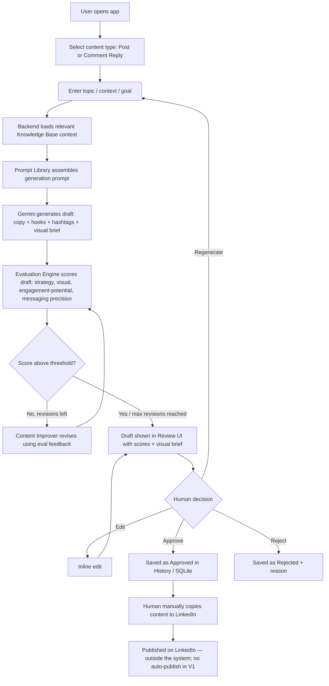

# SYSTEM_WORKFLOW.md — ENTROGX LinkedIn Surge Agent (Mission A)

## 1. Agent Definition

**Mission:** Given a topic/goal from a Media Pod team member, produce a high-quality, on-brand LinkedIn post (or comment reply) draft — with hook variants, hashtags, and a visual brief — that scores well against ENTROGX's four evaluation dimensions, for human review and manual publishing.

**Responsibilities:**
- Load relevant brand context from the Knowledge Base
- Generate draft copy + hook variants + hashtags + visual brief
- Self-evaluate the draft against the four rubric dimensions
- Auto-revise the draft (capped iterations) if it scores below threshold
- Present the draft to a human with transparent scoring and rationale
- Persist every generation and its outcome to history

**Inputs:**
- Content type: `post` or `comment_reply`
- Topic or source content (e.g. an article link/summary, or the comment being replied to)
- Optional goal (awareness / engagement / thought-leadership)
- Optional constraints (target length, specific CTA type)

**Outputs:**
- Post/reply copy
- 2–3 hook/headline variants
- Hashtag set
- Structured visual brief (layout, imagery direction, color direction, overlay text — text only, no image)
- Rubric scores (0–10 per dimension) + rationale
- Revision history (if auto-revised)

**Decision flow:** generate → self-evaluate → revise-if-below-threshold (max N loops) → hand to human.

**Limitations (explicit, V1):**
- Never publishes to LinkedIn directly
- Does not generate images — text brief only
- Does not have access to real-time LinkedIn engagement data
- Does not attempt founder voice — uses official brand voice docs only, until real founder samples are supplied (see `ARCHITECTURE.md` §5 for the pluggable design)
- Knowledge Base is static files, not live-synced from LinkedIn or any external source

**Human approval points:**
- Every single piece of content requires an explicit human **Approve** action before being marked "ready to publish" in history
- Humans can edit inline before approving
- Nothing leaves the system pre-approved or auto-published

## 2. End-to-End Workflow

## 3. Step-by-Step Walkthrough

1. **User opens the app** — React frontend loads, backend `/health` confirms connectivity.
2. **Select content type** — Post or Comment Reply. This determines which generator prompt is used.
3. **Enter topic/context/goal** — free-text topic (post) or the comment/thread being replied to (reply), plus optional goal and constraints.
4. **Backend loads Knowledge Base context** — `kb_loader.py` reads the relevant KB files (brand voice is always included; audience/vocab/CTA/hashtag files selected based on content type) and assembles a context object.
5. **Prompt Library assembles the prompt** — the orchestrator renders `system_prompt.md` + the appropriate generator template (`post_generator.md` or `comment_reply_generator.md`) via Jinja2, injecting the KB context and user input.
6. **Gemini generates the draft** — one call (or a small set of calls) produces post copy, hook variants (`hook_generator.md`), hashtags (`hashtag_generator.md`), and the visual brief (`visual_brief_generator.md`).
7. **Evaluation Engine scores the draft** — a separate Gemini call using `content_evaluator.md` returns 0–10 scores + rationale for each of the four rubric dimensions.
8. **Threshold check** — if the score is below the configured threshold and revision iterations remain, `content_improver.md` revises the draft using the evaluator's rationale, then it is re-scored (loop capped at a small max, e.g. 2 iterations).
9. **Draft shown in Review UI** — the human sees the copy, hook options, hashtags, visual brief, and the rubric scores/rationale side by side.
10. **Human decision:**
    - **Edit** — inline text edit, returns to the review view (no re-scoring required, though a manual "re-evaluate" action can be offered)
    - **Regenerate** — discards the draft and restarts from step 3 with the same or adjusted input
    - **Approve** — saved to SQLite history with status `approved`
    - **Reject** — saved to SQLite history with status `rejected` (+ optional reason), for future prompt-tuning insight
11. **Manual publishing** — the human copies the approved content and posts it to LinkedIn themselves. This step is entirely outside the system in V1.

## 4. Why Human-in-the-Loop Everywhere

The assignment explicitly requires "content for human review only." Every path through the workflow above terminates at a human decision point before anything is considered final — there is no code path that marks content as ready-to-post without an explicit Approve action, and there is no LinkedIn API integration in V1 that could publish it even if there were.
