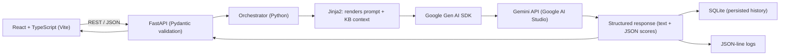

# TECH_STACK.md — ENTROGX LinkedIn Surge Agent (Mission A)

This document explains every technology used in the project, why it was chosen over alternatives, its role in the system, and how all the pieces work together.

## 1. Technology Table

| Technology | Role | Why Chosen (vs. alternatives) |
|---|---|---|
| **Python 3.11+** | Backend language | Dominant language for LLM/agent development; first-class Google Gen AI SDK support; broadly useful skill for AI engineering work beyond this project |
| **FastAPI** | Backend web framework | Async-native, Pydantic-based request/response validation (pairs naturally with structured LLM I/O), automatic OpenAPI docs which double as a live API reference while building the frontend. Chosen over Flask (no built-in validation/async ergonomics) and Django (too heavyweight for this scope) |
| **Pydantic / pydantic-settings** | Data validation + configuration | Type-safe schemas for every request/response and for app config; catches malformed LLM JSON output (e.g. a broken evaluator score) at the boundary instead of deep in application logic |
| **Google Gen AI Python SDK (`google-genai`)** | Gemini API client (Google AI Studio) | Official SDK for the chosen LLM provider (Gemini via Google AI Studio); handles auth, retries, and response parsing so the app doesn't hand-roll HTTP calls to the API. See "Why Google AI Studio" below |
| **Jinja2** | Prompt templating | Keeps prompt text as data (in `backend/app/prompts/`), not hardcoded in Python strings; supports conditionals — this is what makes the `founder_voice.md` pluggable-slot design possible without code changes |
| **SQLite** (via SQLAlchemy or the standard-library `sqlite3`) | Local persistence | Zero-setup, file-based database — fits the "local only, single user" deployment decision exactly. No server process to run, no credentials to manage. Chosen over Postgres/MySQL, which would add setup overhead this project doesn't need in V1 |
| **React** | Frontend UI framework | Component-based, modern, production-style architecture with strong learning value and room to grow (e.g. multi-user roles, richer review UI) in future versions |
| **Vite** | Frontend build tool / dev server | Fast local dev feedback loop, minimal configuration compared to older webpack-based toolchains — appropriate for a beginner-friendly, MVP-scoped frontend |
| **TypeScript** | Frontend language | Type safety across the API boundary — frontend types mirror the backend's Pydantic schemas, catching integration mistakes at compile time rather than at runtime |
| **Python `logging` (JSON lines format)** | Observability | Simple, dependency-free, both human- and machine-readable. Every LLM call is logged with prompt version, model, tokens, latency, and eval scores — essential for debugging *prompt* quality, which is where most of this project's real complexity lives |
| **Uvicorn** | ASGI server | Standard, lightweight server for running the FastAPI app locally |

## 2. Why Google AI Studio (Gemini) for V1

The LLM provider decision for V1 is Google AI Studio (Gemini API), chosen over the Claude API for the following reasons:

| Reason | Detail |
|---|---|
| **Free API access** | Google AI Studio provides a free tier suitable for prototyping and development, keeping V1 build/iteration cost at zero |
| **Easy to get started** | An API key is generated directly from the Google AI Studio console with no billing setup required to begin development |
| **Right-sized for MVP** | V1 is a local, single-user, human-review-only prototype — Google AI Studio is well suited for this stage; a production deployment can reassess LLM provider (Gemini via Vertex AI, Claude API, or another provider) once the project moves past MVP |

This is a swappable decision, not an architectural one: the LLM client wrapper (`backend/app/services/llm_client.py`) is the single place in the codebase that knows which provider it's calling. Nothing else in the system — the orchestrator, prompt library, evaluation engine, or frontend — has any provider-specific knowledge, so switching providers later (e.g. to Claude API, or to Gemini via Vertex AI for production) touches only that one file.

## 3. What Was Deliberately Left Out (and why)

| Not Used | Reason |
|---|---|
| Redux / Zustand / React Query | Frontend state is small (a handful of screens); a state-management library would add complexity without a corresponding benefit at this scale |
| Vector database / embeddings (RAG) | The Knowledge Base is a handful of Markdown/YAML files, small enough to inject directly into prompts. A vector store only earns its complexity once the KB outgrows the context window |
| Docker / cloud hosting | V1 is explicitly local-only, single-user; containerization and hosting add operational scope (secrets management, auth) that this phase doesn't need |
| LinkedIn API SDK | V1 has no publishing capability by design (assignment requires human-review-only) |
| Image-generation SDKs (diffusion models, Canva API) | V1's visual output is a text-only brief; image generation is future scope |

## 4. How the Technologies Work Together

**Request lifecycle, end to end:**
1. The **React/TypeScript** frontend sends a JSON request (e.g. "generate a post about X") to the backend over REST.
2. **FastAPI** receives it, and **Pydantic** validates the shape of the request before any business logic runs.
3. The **Orchestrator** (plain Python service code) coordinates the rest: it asks the Knowledge Base Loader for brand context, then asks the Prompt Library to render a prompt.
4. **Jinja2** renders the prompt template, injecting the Knowledge Base context — including conditionally including founder-voice guidance only if `founder_voice.md` exists.
5. The **Google Gen AI SDK** sends that rendered prompt to the **Gemini API (Google AI Studio)** and returns the response.
6. The orchestrator passes the draft through the Evaluation Engine (a second Gemini call via the same SDK) to get rubric scores, revising via the Content Improver prompt if needed.
7. The final draft + scores are persisted to **SQLite** and appended to the **JSON-line log**, then returned through FastAPI back to the React frontend as JSON, validated again by Pydantic on the way out.
8. **TypeScript** types on the frontend mirror the Pydantic response schema, so the UI can render scores, hooks, and the visual brief with compile-time safety.

This is a deliberately conventional, well-documented stack: each technology has one clear job, and the "agent" itself lives almost entirely in the **Prompt Library** and **Knowledge Base** (data), not in the surrounding application code — which is where a first agent project should concentrate its effort.
